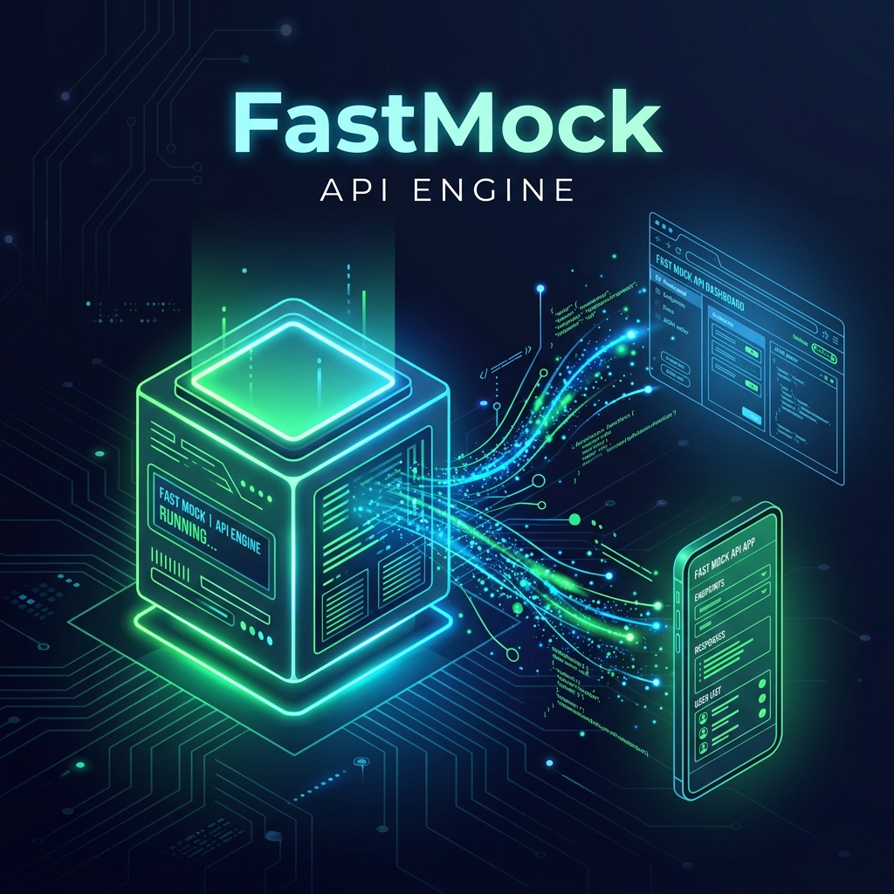

<div align="right">
  <b>🇷🇺 Русский</b> | <a href="README.md">🇬🇧 English</a>
</div>

# ⚡ FastMock API Engine

[](https://pypi.org/project/fastmock-api/)
[](https://www.python.org/downloads/)
[](https://fastapi.tiangolo.com)
[](https://www.docker.com/)
[](https://github.com/Artem-SPb/fastmock/actions)

**FastMock** — это легковесный, локальный Mock-сервер на базе FastAPI. Он создан для фронтенд- и мобильных разработчиков, которым нужен работающий, реалистичный REST API "здесь и сейчас", без ожидания бэкенд-команды.

 *(Здесь будет ваше превью)*

## 🚀 Быстрый старт

### Способ 1: Установка через pip (Рекомендуется)
```bash
pip install fastmock-api
fastmock --port 8080
```

> ⚠️ **Важное замечание для Windows:** В консоли может быть написано `Uvicorn running on http://0.0.0.0:8080`. Это означает, что сервер доступен по сети. Однако браузеры на Windows **не умеют** открывать адрес `0.0.0.0` напрямую. Переходите по локальному адресу: **[http://127.0.0.1:8080/docs](http://127.0.0.1:8080/docs)**.

### Способ 2: Запуск через Docker
```bash
git clone https://github.com/Artem-SPb/fastmock.git
cd fastmock
docker compose up
```
Откройте **http://127.0.0.1:8000/docs** в браузере.

## 👨‍💻 Автор
**Artem-SPb** 
- GitHub: [@Artem-SPb](https://github.com/Artem-SPb)

Создано в качестве портфолио-проекта, демонстрирующего современную архитектуру на Python, работу с экосистемой FastAPI и фокус на Developer Experience (DX).

*Если проект оказался полезным, не забудьте поставить звездочку ⭐!*
